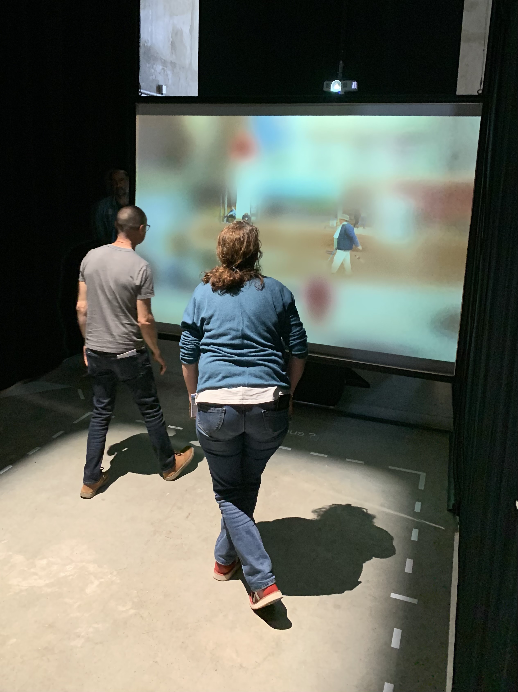

# 🖼 Aperçus

- [🖼 Aperçus](#-aperçus)
  - [🗒 Prérequis](#-prérequis)
  - [🚀 Démarrage rapide](#-démarrage-rapide)
  - [🚴 Utilisation](#-utilisation)

## 🗒 Prérequis

**🔨 Hardware**
- Un ordinateur sous Windows
- Un vidéoprojecteur
- Un noeud [Augmenta](https://augmenta.tech/)
- Une tablette
  
**💽 Software**
- [Touch Designer](https://derivative.ca/download)
- [Augmenta Fusion](https://augmenta.tech/downloads/)

## 🚀 Démarrage rapide

1. Vérifiez que votre ordinateur est connecté au même réseau que la tablette et le noeud Augmenta.
2. Ouvrez le fichier `augmenta.fusion` avec Augmenta Fusion.
3. Ouvrez le fichier `touch-designer.toe` avec Touch Designer.

## 🚴 Utilisation

Déplacez-vous (max 2 personnes) devant le vidéoprojecteur sous la zone de captation du noeud Augmenta pour déplacer des cercles sur l'écran.

---
